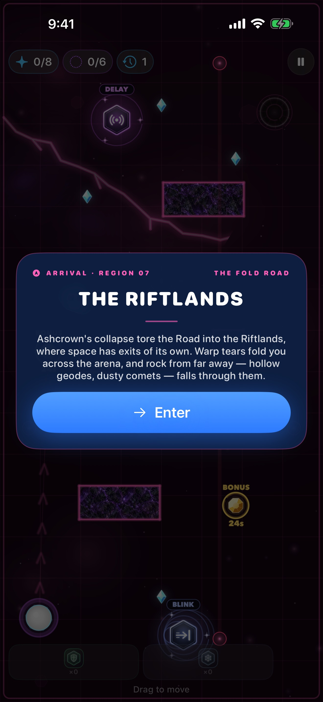
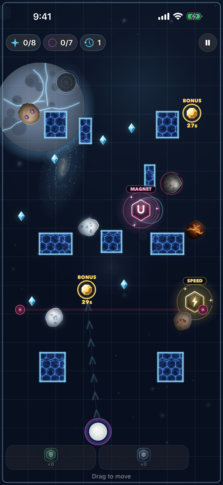
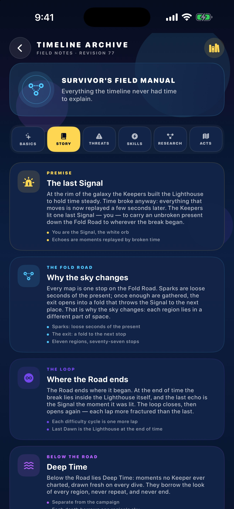
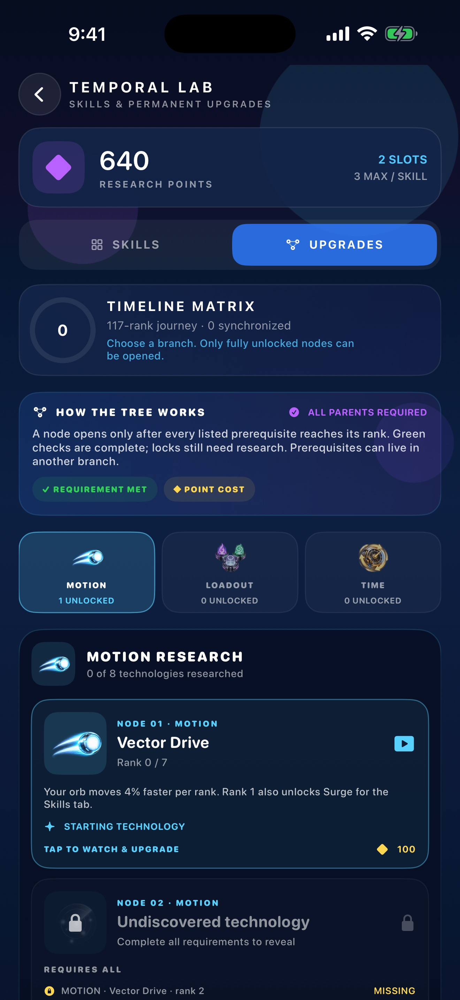
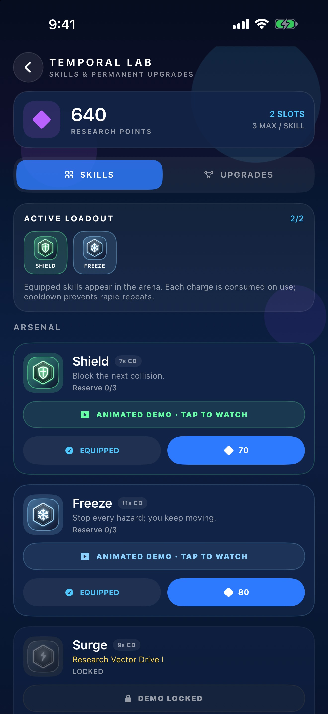
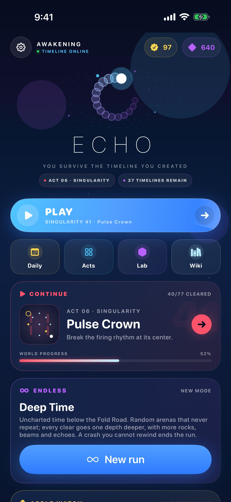
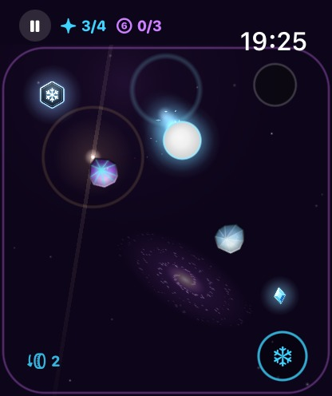
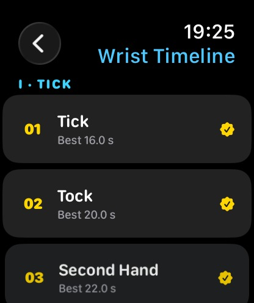
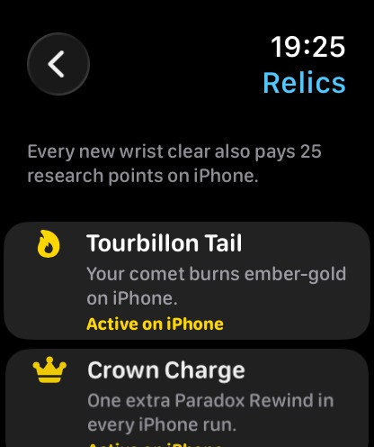
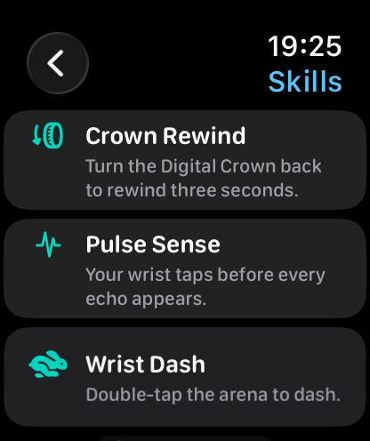

# ECHO

ECHO is a top-down route-planning survival puzzle for iPhone, iPad and Apple Watch. You guide the Signal, collect every spark, and reach the exit. Every few seconds an echo appears and walks the line you already drew. Your own route becomes the hazard.

> You don't cooperate with your past. You survive it.

Seventy-seven maps sit in eleven seven-map regions of space, strung along one road through a broken galaxy. Clearing the complete timeline starts a new named difficulty cycle while preserving previous records. Later regions add moving debris, timed crystals, beams, fold faults, field wells, and a short Candy Timeline training pocket. The in-game Keeper Archive documents every rule. Settings includes About, Terms, Privacy, and a confirmed progress reset that keeps audio preferences.

The App Store build is a **$1.99 one-time download**. No ads, accounts, or in-app purchases. Progress stays on the device.

The game is in **English and Russian**. It follows the device language, and Settings → Language opens the system's per-app switch.

<p align="center">
  
  
  
  <br>
  
  
  
  <br>
  
  
  
  <br>
  
  
  
  
</p>

See the [player guide](docs/GUIDE.md), [environment asset map](docs/ASSET_INTEGRATION.md), [App Store release guide](docs/APP_STORE_RELEASE.md), [About](ABOUT.md), [Terms of Use](TERMS.md), and [Privacy Policy](PRIVACY.md).

## The story

The Keepers built the Lighthouse as a reference station. It never ruled time; it let distant stations along the **Fold Road** compare their records. Then came **the Break**: a failed controller began treating the last confirmed state as an order to restore it, and every correction demanded another. The recovery network still replays recorded movement a few seconds late. Those replays are the echoes, and your own route is one of them. The orb is the Signal, the reference the Lighthouse still sends. Sparks are state records; gathering all of them confirms the route and opens the exit, a fold that carries the Signal to the next station.

Each act is one region along the Road. That is why the sky, the walls and the hazards change between acts, and why they stay the same inside one:

| Act | Region | What is out there |
|---|---|---|
| TRACE | The Lighthouse | The reference station where the Signal was lit. |
| DRIFT | Drift Gardens | Greenhouse domes drifting on broken schedules. |
| FRACTURE | Tessera Shelf | An ice moon split into narrow passages. |
| DEBRIS | Hollow Belt | What is left of Cinder — still moving. |
| PARADOX | Proving Grounds | Test chambers still running their old trials. |
| SINGULARITY | Ashcrown Corona | Observation stations around a dying star. |
| RIFT | The Riftlands | Damaged links that move the Signal elsewhere. |
| GRAVITY | The Undertow | Field wells near Ashcrown's compact remnant. |
| MIRAGE | Glass Nebula | Where image, record and object disagree. |
| CONFECTION | Candy Timeline | A children's training mode without its limits. |
| ETERNITY | Last Dawn | The Lighthouse again — at a new moment. |

Every map names its place on the Road and carries a one-line log that matches its hazards; both show in the Atlas and on the pause card, and the first map of each region opens with an arrival card. Clearing a region recovers a Keeper record in the Archive's **Story** page, with science notes that separate established physics from Keeper fiction. Clearing all 77 opens another, harder pass. Deep Time lies off the Road, the Daily Rift reopens one stop each day, and the watch is the Keepers' chronometer.

## The loop

Drag anywhere. The Signal seeks your finger; lift it and the Signal stops where it is and pulses so you can find it. Sparks open the exit. Echoes replay your path and end the run on contact. After the first move, the purple ring at spawn counts down to the next echo. It is not a time limit.

Seventy-seven maps in eleven seven-map acts, one per region: TRACE, DRIFT, FRACTURE, DEBRIS, PARADOX, SINGULARITY, RIFT, GRAVITY, MIRAGE, CONFECTION, and ETERNITY. Each map has three Route Seals — CLEAR, CONTROL, PARADOX. Play continues from the next unbeaten level. Clearing all 77 begins a harder named cycle with faster hazards and a fresh seal record.

A crash can **Paradox Rewind** three seconds. The discarded branch replays once as a paradox ghost. After a clear, a short **Route Replay** plays the whole route at once.

## Hazards and tools

- **Echoes** — up to five copies. Double-tap to dash.
- **Asteroids** — bounce, patrol, orbit, or sit as a fixed core with satellites. Every rock is generated procedurally from one of eight materials. Cryo Ice, Chrono Crystal, and Basalt crack after hitting solid geometry and eventually split into physical debris along those cracks; Void Alloy never breaks. From DEBRIS on, glowing Magma Cores shed embers and pitted Meteoric Iron takes six hits; from RIFT on, Hollow Geodes split open on crystal and Comet Frost trails vapour and bursts on its first hit.
- **Timed crystals** — every crystal is needed for the exit. Take one before its ring empties for bonus Freeze time and points.
- **Beams** — emitters telegraph, charge, and fire. Freeze holds every beam.
- **Fold faults** — entering a calm rift gives a brief hold, a collapsing one is lethal, a Warp rift moves the Signal, shifts the replay and flips horizontal steering for a few seconds, and a Candy rift opens a short, faster training mode.
- **Field wells** — local field traps, not stellar black holes. They bend movement, and the dark core ends the run.
- **Timed gates**, **echo collision scars**, and **paradox ghosts** after a rewind.
- **Signal Lab** — equip a limited loadout and research the 24-node Signal Matrix. Every number a node shows is read from the same tuning the run applies.
- **Keeper Archive** — the in-game manual for controls, clocks, hazards, skills, research, regions and the recovered story.

The first time you meet an echo, a rock, a rift, a gate, Freeze, Phase, or an echo collision, a short card explains it. The first time you reach a region, an arrival card says where the Signal has landed.

Behind every arena a distant sky moves slowly, and it tells you where you are. Each region has its own landmark that draws nearer as you cross it: the Lighthouse's ringed giant, the red sun over the gardens, cracked Tessera, the broken world of the Hollow Belt, a sweeping pulsar, collapsing Ashcrown, a tear across the sky, Ashcrown's compact remnant with its disc, mirrored giants, a candy world with its moon, and the light of Last Dawn rising at the edge. Around it drift a galaxy, twinkling stars, the odd meteor and a soft light that breathes and sweeps past. It all holds still when Reduce Motion is on.

## Deep Time

An endless expedition, separate from the campaign and open from Home. Every depth is a random arena drawn from the run's seed and checked for a connected route before it is played; it is a static check, and layouts can recur. Rocks, beams, echoes, field wells and rifts ramp up as the run goes deeper. Each clear pays research points and records the best depth. Paradox Rewind still works, but a crash with nothing left to rewind ends the run, and a run left after a clear can be resumed from Home.

## Apple Watch

The download includes a watch app that runs the same rules on the wrist.

- **Chronometer rooms** — twelve compact rooms in three acts (Tick, Crown, Tourbillon) that tune the Keeper Chronometer. They help the campaign but are not required to finish it. Each room opens after the previous one is cleared and starts with its own log line. Tap where the orb should fly; it keeps going after your finger lifts, so your thumb never hides it.
- **Watch skills** — turn the Digital Crown back to rewind three seconds. Pulse Sense taps your wrist before each echo. Wrist Dash (double-tap) opens after 2 clears. Tick Freeze (button, or the double-tap hand gesture) opens after 6.
- **Chronometer Rewards** — every first clear on the watch pays 25 research points in the phone game. Four clears unlock the ember-gold *Tourbillon Tail*, eight add a Paradox Rewind charge (*Crown Charge*), and all twelve make echoes arrive 0.5 s later (*Mainspring*). The Home screen tracks progress and has a switch for the tail.
- **iPhone Remote** — while a map runs on the phone, open Remote on the watch. The whole face becomes a thumbstick and a double-tap dashes. Underneath, a close-up of the phone's arena follows the orb, and rocks, echoes, the next spark and the exit that are off the face show up as markers on its rim. The wrist taps for sparks, echoes, the exit opening and a rock or echo closing in, and after a crash a backward turn of the Crown rewinds the phone. The phone HUD shows a WATCH chip while the wrist is steering.

WatchConnectivity carries clears through the application context (plus a queued transfer for each first clear). Remote play sends a few bytes of binary per message: the phone names its level once and the watch builds the same arena from its own catalog, then only the moving parts travel, up to 20 frames a second. Each side keeps just a couple of messages waiting for replies and always sends the newest state, so a slow Bluetooth link drops stale stick positions instead of queueing lag, and the phone keeps steering from the held stick every frame.

## Requirements

- Xcode 16+ / iOS 18 SDK
- [XcodeGen](https://github.com/yonaskolb/XcodeGen)

```bash
cd Echo
xcodegen generate
xed Echo.xcodeproj
```

Bundle ID `com.sergiiziborov.Echo`.

```bash
xcodebuild test -scheme Echo -destination 'platform=iOS Simulator,name=iPhone 17 Pro'
```

The `EchoWatch` scheme builds and runs the watch app alone. Debug builds accept `-wrist-map N`, `-wrist-autopilot`, `-wrist-remote`, `-wrist-remote-demo` and `-wrist-unlock-all` for reviews and screenshots, like the phone's `-shot-*` arguments.

`scripts/install-device.sh [device-id]` builds a signed Debug copy and installs it on a connected iPhone, the first available one by default. The watch app rides inside `Echo.app`, so the iPhone's Watch app puts it on the paired Apple Watch.

For Xcode Cloud, the checked-in project is discoverable at clone time and `ci_scripts/ci_post_clone.sh` regenerates it from `project.yml`. Use an iOS Archive action with **App Store Connect** distribution preparation and a **TestFlight Internal Testing** post-action. The exact release checklist is in the [App Store release guide](docs/APP_STORE_RELEASE.md).

## Layout

```
Echo/App            launch, navigation, Apple Watch link
Echo/Play           run session, HUD, encounter cards
Echo/Arena          SpriteKit scene, comet trails, procedural rocks and pickups, FX
Echo/Simulation     rules, catalog, progress (no SpriteKit)
Echo/Shell          home, atlas, lab, archive, settings, legal, wrist relics
EchoWatch/          watch app: chronometer rooms, run scene, iPhone remote
Shared/             wrist maps, relic rules and the phone ↔ watch protocol
Shared/Localization every player-facing line in English and Russian
EchoTests/          recorder, collision, catalog, graphics, wrist sync
```

`WorldSimulation` is independent of SpriteKit so the rules run in tests and on the watch. Player text lives in `Localizable.xcstrings` under stable keys, read through `Copy`; save data, map IDs, enum raw values and the watch protocol never depend on it, so a language change cannot change a run. `scripts/l10n.py` adds lines in both languages and checks that they take the same parameters. The comet trail, rock painter, ability tokens and `BitmapCanvas` use Core Graphics bitmaps instead of UIKit renderers, so the phone and the watch draw them identically. Source files stay at or under 400 lines, and each folder holds at most six files.

## Support

For gameplay or release questions, email [sergii.ziborov@gmail.com](mailto:sergii.ziborov@gmail.com) or open a [GitHub issue](https://github.com/sergii-ziborov/Echo/issues).

## License

The current revision is proprietary; see [LICENSE](LICENSE). Earlier revisions released under MIT retain that license. © 2026 Sergii Ziborov.
