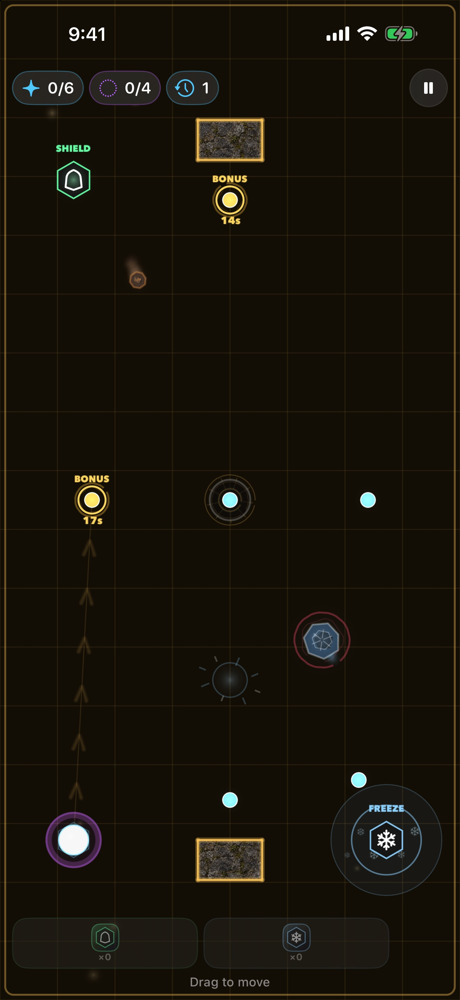
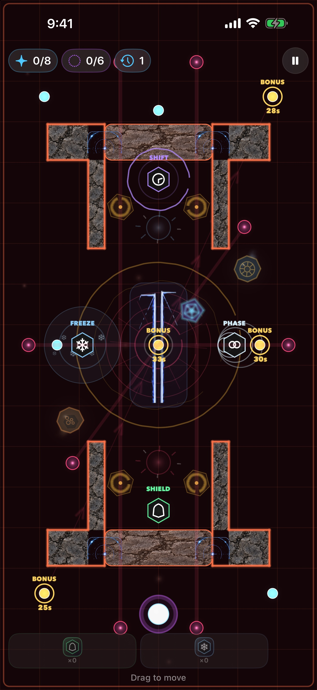
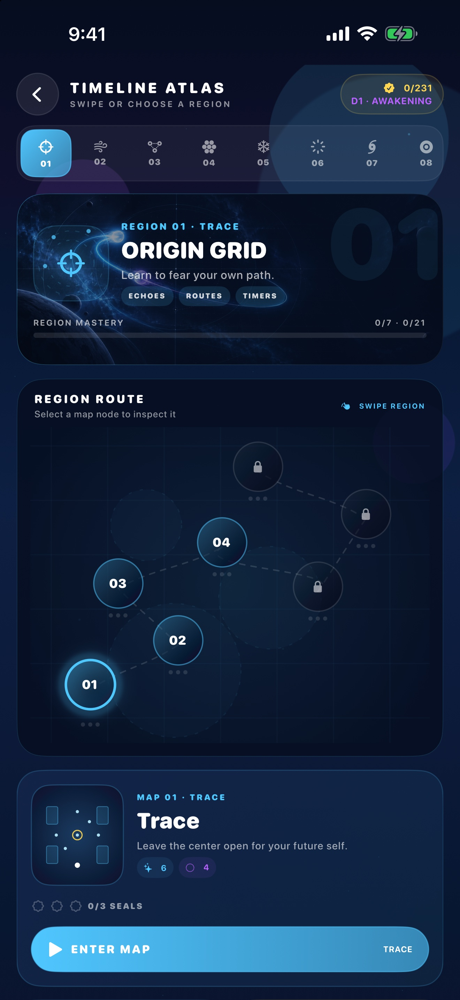
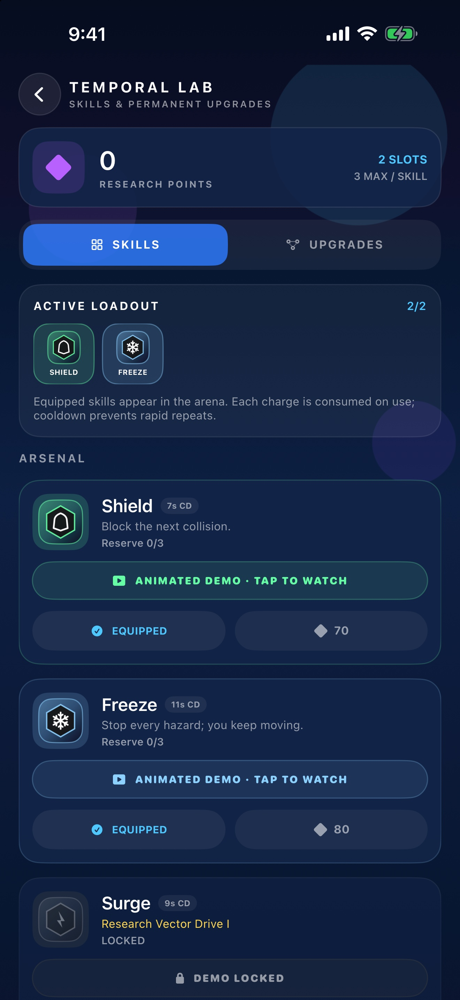
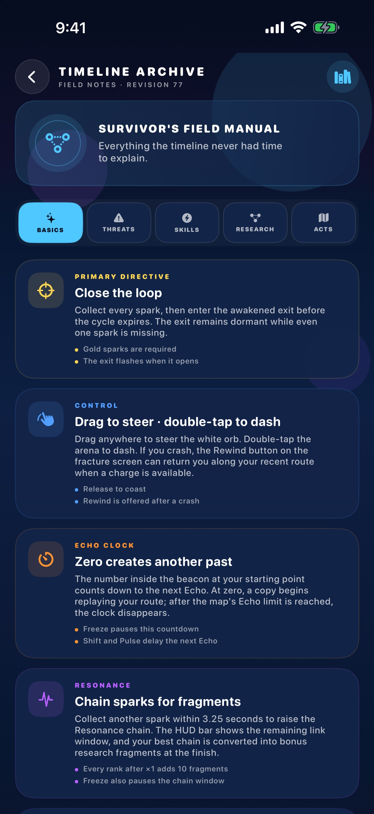
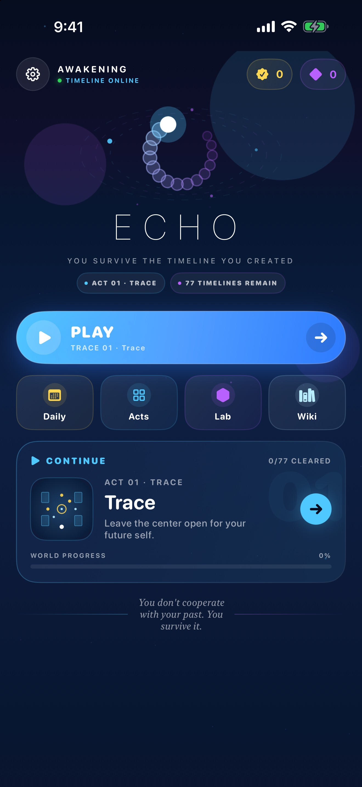

# ECHO

ECHO is a top-down temporal survival puzzle for iPhone and iPad. You steer a glowing orb, collect sparks, and reach the exit. Every few seconds a copy of you appears and walks the line you already drew. The past is the hazard.

> You don't cooperate with your past. You survive it.

Seventy-seven maps sit in eleven seven-map epochs. Clearing the complete timeline starts a new named difficulty cycle while preserving previous records. Later epochs add moving debris, timed crystals, laser arrays, spatial folds, gravity wells, and a temporary Candy Timeline pocket. The in-game Wiki documents every rule. Settings includes About, Terms, Privacy, and a confirmed progress reset that keeps audio preferences.

The App Store build is a **$1.99 one-time download**. No ads, accounts, or in-app purchases. Progress stays on the device.

<p align="center">
  
  
  
  <br>
  
  
  
  <br>
  
</p>

See the [player guide](docs/GUIDE.md), [environment asset map](docs/ASSET_INTEGRATION.md), [App Store release guide](docs/APP_STORE_RELEASE.md), [About](ABOUT.md), [Terms of Use](TERMS.md), and [Privacy Policy](PRIVACY.md).

## The loop

Drag anywhere. The orb seeks your finger. Lift your finger and the orb pulses so you can find it again. Sparks open the exit. Echoes replay your path and kill on contact. After the first move, the purple ring at spawn counts down to the next copy.

Seventy-seven maps in eleven seven-map epochs: TRACE, DRIFT, FRACTURE, DEBRIS, PARADOX, SINGULARITY, RIFT, GRAVITY, MIRAGE, CONFECTION, and ETERNITY. Each map has three Temporal Seals — CLEAR, CONTROL, PARADOX. Play continues from the next unbeaten level. Clearing all 77 begins a harder named cycle with faster hazards and a fresh seal record.

A crash can **Paradox Rewind** three seconds. The failed branch stays as an unstable echo. After a clear, a short **Temporal Replay** plays the whole route at once.

## Hazards and tools

- **Echoes** — up to five copies. Double-tap to dash.
- **Asteroids** — bounce, patrol, orbit, or sit as a fixed core with satellites. Cryo Ice, Chrono Crystal, and Basalt begin fracturing after hitting solid geometry; Void Alloy never breaks.
- **Temporal lasers** — emitters telegraph, charge, and fire. Freeze suspends and disarms every laser.
- **Reality rifts** — calm tears freeze time, collapsing tears kill, Warp tears fold space, and Candy tears open a faster pocket timeline.
- **Black holes** — bend movement and destroy the timeline at the core.
- **Time gates**, **time collisions**, and **paradox ghosts** after a rewind.
- **Lab** — equip a limited loadout and research a 24-node Timeline Matrix.
- **Timeline Archive** — in-game wiki for controls, clocks, hazards, research, and all 77 maps.

The first time you meet an echo, a rock, a rift, a gate, freeze, phase, or a time collision, a short card explains it.

## Requirements

- Xcode 16+ / iOS 18 SDK
- [XcodeGen](https://github.com/yonaskolb/XcodeGen)

```bash
cd Echo
xcodegen generate
xed Echo.xcodeproj
```

Bundle ID `com.sergiiziborov.Echo`.

```bash
xcodebuild test -scheme Echo -destination 'platform=iOS Simulator,name=iPhone 17 Pro'
```

For Xcode Cloud, the checked-in project is discoverable at clone time and `ci_scripts/ci_post_clone.sh` regenerates it from `project.yml`. Use an iOS Archive action with **App Store Connect** distribution preparation and a **TestFlight Internal Testing** post-action. The exact release checklist is in the [App Store release guide](docs/APP_STORE_RELEASE.md).

## Layout

```
Echo/App            launch and navigation
Echo/Play           run session, HUD, encounter cards
Echo/Arena          SpriteKit scene, trails, textures, FX
Echo/Simulation     rules, catalog, progress (no SpriteKit)
Echo/Shell          home, atlas, lab, wiki, settings, legal
EchoTests/          recorder, collision, catalog, graphics
```

`WorldSimulation` is independent of SpriteKit so the rules run in tests. Source files stay at or under 400 lines, and each folder holds at most six files.

## Support

For gameplay or release questions, email [sergii.ziborov@gmail.com](mailto:sergii.ziborov@gmail.com) or open a [GitHub issue](https://github.com/sergii-ziborov/Echo/issues).

## License

The current revision is proprietary; see [LICENSE](LICENSE). Earlier revisions released under MIT retain that license. © 2026 Sergii Ziborov.
