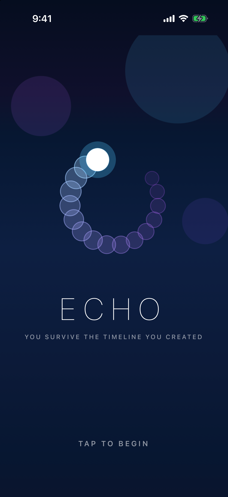
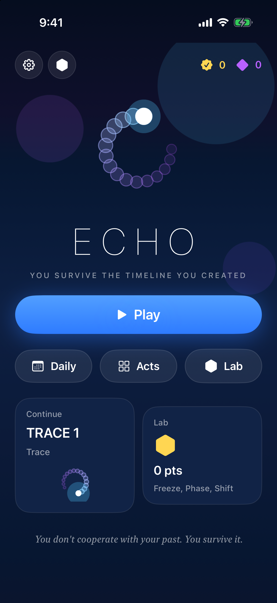
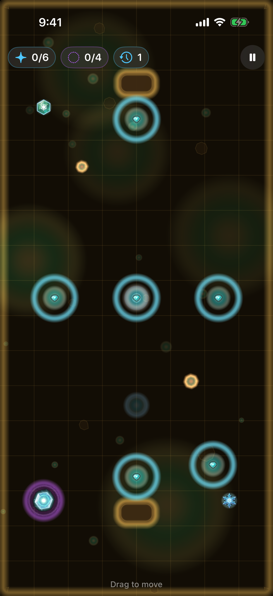
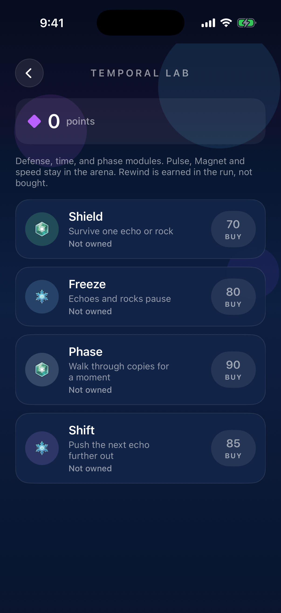

# ECHO

A path-replay puzzle for iPhone and iPad. You steer a glowing orb, collect sparks, and reach the exit. Every few seconds a copy of you appears and walks the line you already drew. The past is the hazard.

> You don't cooperate with your past. You survive it.

<p align="center">
  
  
  
  
</p>

## The loop

Drag anywhere. The orb seeks your finger. Sparks open the exit. Echoes replay your path and kill on contact. After the first move, the purple ring at spawn counts down to the next copy.

Thirty handcrafted maps in five acts: TRACE, DRIFT, FRACTURE, DEBRIS, PARADOX. Each map has three Temporal Seals — CLEAR, CONTROL, PARADOX. Play continues from the next unbeaten level. Arenas shift palette — void, ember, moss, ion, ice, dust.

A crash can **Paradox Rewind** three seconds. The failed branch stays as an unstable echo. After a clear, a short **Temporal Replay** plays the whole route at once.

## Hazards and tools

- **Echoes** — up to five copies. Double-tap to dash.
- **Asteroids** — bounce, patrol, or orbit. Freeze stops them too.
- **Time rifts** — open and close. A calm tear skips time. A collapsing one is a collision.
- **Time gates** — bars that vanish and return on a clock. Freeze holds them too.
- **Time collisions** — when two copies occupy the same beat they leave a lethal scar for a few seconds.
- **Paradox ghosts** — a rewind leaves the discarded timeline walking for a few seconds.
- **Lab** — stock Shield, Freeze, Phase, Shift and tap them in a run. Pulse and Magnet only drop in the arena.

The first time you meet an echo, a rock, a rift, a gate, freeze, phase, or a time collision, a short card explains it. Freeze tints the arena and crystals the orb. Daily Rift uses a stable calendar seed and pays points only on the first clear.

## Requirements

- Xcode 16+ / iOS 18 SDK
- [XcodeGen](https://github.com/yonaskolb/XcodeGen)

```bash
cd Echo
xcodegen generate
xed Echo.xcodeproj
```

Bundle ID `com.sergiiziborov.Echo`.

```bash
xcodebuild test -scheme Echo -destination 'platform=iOS Simulator,name=iPhone 17 Pro'
```

## Layout

```
Echo/          SwiftUI shell, SpriteKit arena, simulation
EchoTests/     recorder, spawn, collision, rewind, daily, seals
```

`WorldSimulation` is independent of SpriteKit so the rules run in tests.

## License

MIT. © 2026 Sergii Ziborov.
