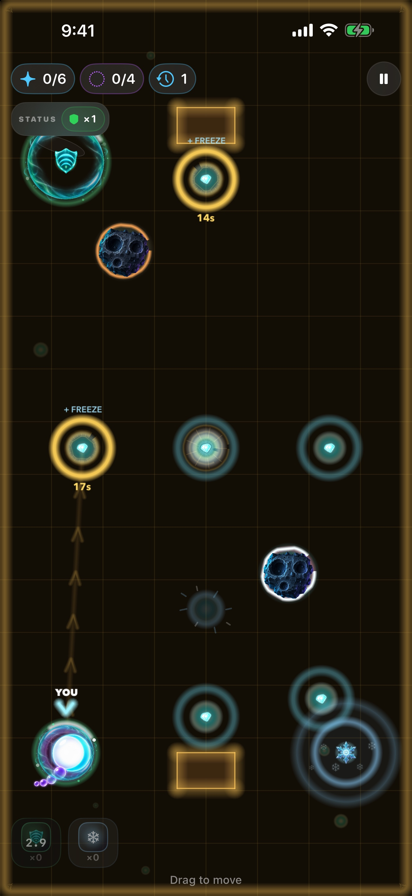
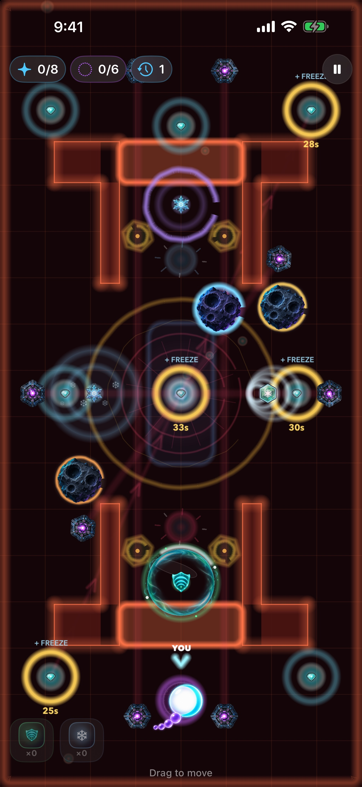
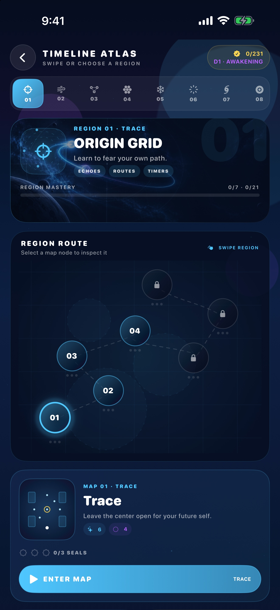
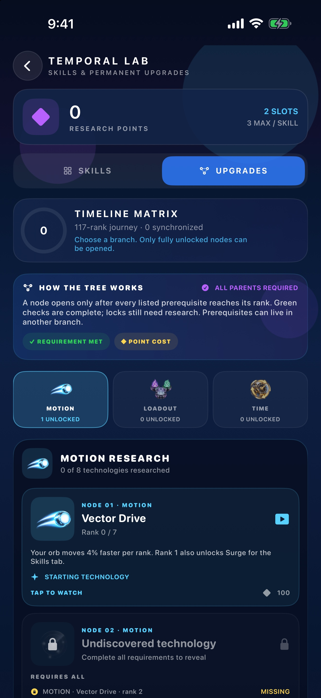
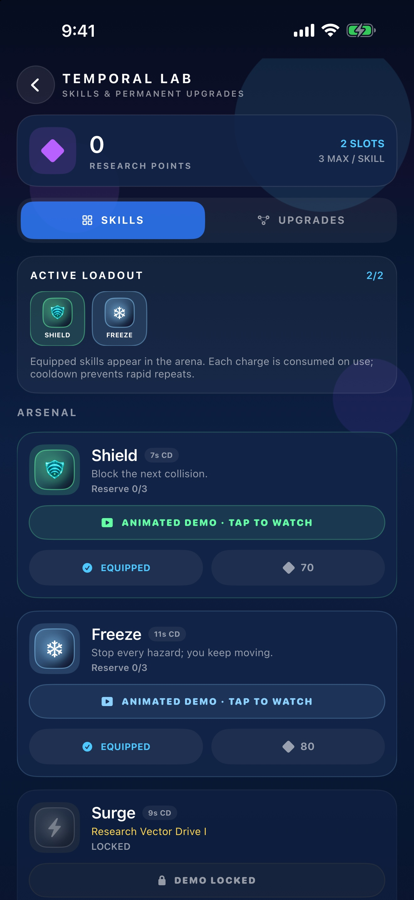
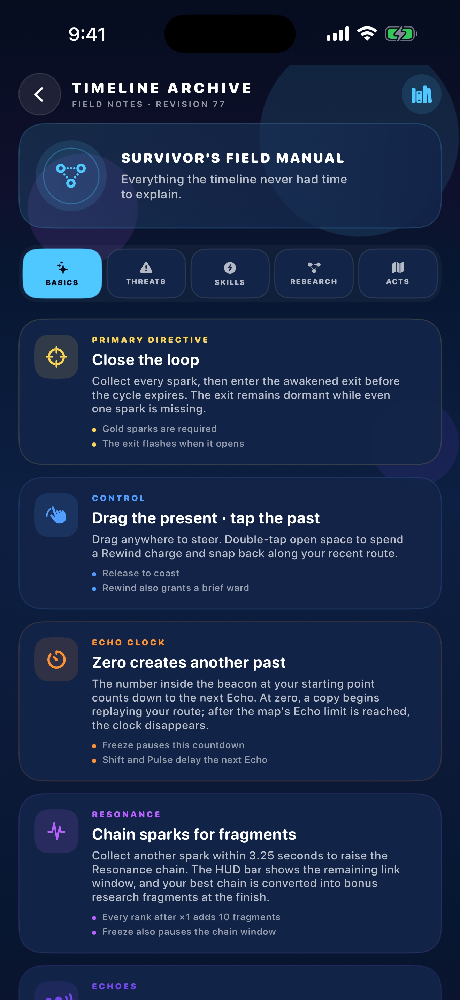
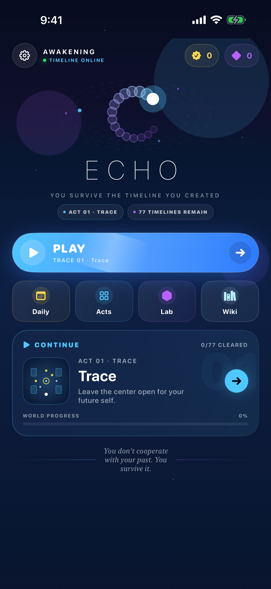

# ECHO

ECHO is a top-down temporal survival puzzle for iPhone with 77 maps arranged as 11 seven-map epochs. Clearing the complete timeline starts a new named difficulty cycle while preserving previous records.

The later epochs introduce moving debris, timed crystals, laser arrays, spatial folds, mirrored controls, gravity wells, black holes and a temporary Candy Timeline pocket dimension. Rifts, lensing rings, pocket backgrounds, emitters, and debris shells are continuously animated rather than static decals. The in-game Wiki documents every rule, while Settings includes a confirmed full-progress reset that preserves accessibility/audio preferences.

Asteroids now use twelve appearances across four collision materials, including porous, spiky, volcanic, shattered, ice-shard, obsidian and relic silhouettes. Twelve wall finishes rotate through the six arena themes, while closed/open gate actuators, slow-field membranes and laser emitters have dedicated sprites. Wall texture is applied per connected wall shape and only exposed boundaries glow, so touching pieces do not gain bright internal seams or stretch textures across distant islands.

A path-replay puzzle for iPhone and iPad. You steer a glowing orb, collect sparks, and reach the exit. Every few seconds a copy of you appears and walks the line you already drew. The past is the hazard.

> You don't cooperate with your past. You survive it.

<p align="center">
  
  
  
  <br>
  
  
  
  <br>
  
</p>

See the [player guide](docs/GUIDE.md) for controls, clocks, abilities and research, the [environment asset map](docs/ASSET_INTEGRATION.md) for sprite coverage, and the [App Store release guide](docs/APP_STORE_RELEASE.md) for submission assets and status.

## The loop

Drag anywhere. The orb seeks your finger. Sparks open the exit. Echoes replay your path and kill on contact. After the first move, the purple ring at spawn counts down to the next copy.

Seventy-seven maps in eleven seven-map epochs: TRACE, DRIFT, FRACTURE, DEBRIS, PARADOX, SINGULARITY, RIFT, GRAVITY, MIRAGE, CONFECTION, and ETERNITY. Each map has three Temporal Seals — CLEAR, CONTROL, PARADOX. Play continues from the next unbeaten level. Clearing all 77 begins a harder named cycle with faster hazards and a fresh seal record. Arenas shift palette and atmosphere; every map receives route-aware floor landmarks such as trajectory lanes, sector anchors, hazard rings, and reactor diagrams, while clear arenas deliberately omit the heavy nebula haze. A geometry audit verifies every objective, orbit, patrol, laser endpoint, gravity well, and arena boundary.

A crash can **Paradox Rewind** three seconds. The failed branch stays as an unstable echo. After a clear, a short **Temporal Replay** plays the whole route at once.

## Hazards and tools

- **Echoes** — up to five copies. Double-tap to dash.
- **Asteroids** — bounce, patrol, orbit, or anchor a map as a large fixed core with three smaller satellites. Moving rocks leave a restrained material-tinted trail. Cryo Ice, Chrono Crystal, and Basalt begin fracturing after hitting solid geometry, with spreading cracks and debris instead of a visible countdown; Void Alloy never breaks. Freeze pauses both motion and fracture time.
- **Temporal lasers** — generated mechanical emitters telegraph, charge, discharge, and send energy pulses down staggered beams. Event Horizon adds a sweeping beam; Freeze suspends and disarms every laser.
- **Reality rifts** — calm tears freeze time, collapsing tears kill, Warp tears fold space and mirror steering, and Candy tears open a faster pocket timeline with a wider Resonance window.
- **Black holes** — bend movement inside their lensing radius and destroy the timeline at the core. Freeze suspends their pull.
- **Time gates** — bars that vanish and return on a clock. Freeze holds them too.
- **Time collisions** — when two copies occupy the same beat they leave a lethal scar for a few seconds.
- **Paradox ghosts** — a rewind leaves the discarded timeline walking for a few seconds.
- **Timed crystals** — secure them before the ring expires for bonus Freeze time and points. Freeze pauses their countdown.
- **Resonance routes** — collect sparks within 3.25 seconds of one another to build a visible chain and earn a route-planning score bonus.
- **Lab** — equip a limited active loadout, stock charges, and navigate a 24-node Timeline Matrix. Its three branches cover movement and dash recovery, slots/reserves/shield protocol, and cooldown/laser forecast/Freeze/Shift/Rewind research. Tap a node to inspect its prerequisites and next rank before buying.
- **Timeline Archive** — an in-game wiki covering controls, clocks, rewards, every hazard and skill, the full research tree, and all 77 maps by epoch.

The first time you meet an echo, a rock, a rift, a gate, freeze, phase, or a time collision, a short card explains it. Freeze tints the arena and crystals the orb. Daily Rift uses a stable calendar seed and pays points only on the first clear.

## Requirements

- Xcode 16+ / iOS 18 SDK
- [XcodeGen](https://github.com/yonaskolb/XcodeGen)

```bash
cd Echo
xcodegen generate
xed Echo.xcodeproj
```

Bundle ID `com.sergiiziborov.Echo`.

```bash
xcodebuild test -scheme Echo -destination 'platform=iOS Simulator,name=iPhone 17 Pro'
```

For Xcode Cloud, the checked-in project is discoverable at clone time and
`ci_scripts/ci_post_clone.sh` regenerates it from `project.yml`. Use an iOS
Archive action with **App Store Connect** distribution preparation and a
**TestFlight Internal Testing** post-action. The exact release checklist is in
the [App Store release guide](docs/APP_STORE_RELEASE.md).

## Layout

```
Echo/          SwiftUI shell, SpriteKit arena, simulation
EchoTests/     recorder, spawn, collision, rewind, daily, seals
```

`WorldSimulation` is independent of SpriteKit so the rules run in tests.

## Support

For gameplay or release questions, email [sergii.ziborov@gmail.com](mailto:sergii.ziborov@gmail.com) or open a [GitHub issue](https://github.com/sergii-ziborov/Echo/issues). See the [privacy policy](PRIVACY.md) for on-device data handling.

## License

The current revision is proprietary; see [LICENSE](LICENSE) for permissions and commercial licensing. Earlier revisions released under MIT retain that license—this change does not revoke previously granted rights. © 2026 Sergii Ziborov.
